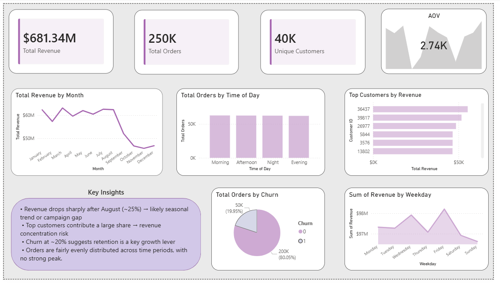

# 📊 E-commerce Dashboard

## Objective

This dashboard was built to visualize key metrics and insights from the e-commerce dataset, focusing on **revenue trends, customer behavior, and churn analysis**.

---

## Key KPIs

* **Total Revenue** – Overall business performance.
* **Total Orders** – Customer activity level.
* **Unique Customers** – Size of customer base.
* **Average Order Value (AOV)** – Average spend per order.

---

##  Visuals & Insights

###  Monthly Revenue Trend

* Revenue remains relatively stable for most of the year.
* A noticeable drop (~25%) occurs after August, indicating possible seasonality or campaign impact.

---

###  Orders by Time of Day

* Orders are fairly evenly distributed across time periods.
* No strong peak suggests consistent demand throughout the day.

---

###  Top Customers by Revenue

* A small group of customers contributes a large portion of total revenue.
* Highlights potential for targeted retention strategies.

---

###  Revenue by Weekday

* Revenue varies slightly across weekdays.
* Certain days show stronger performance, useful for planning promotions.

---

###  Customer Churn

* Around **20% of customers have churned**.
* Indicates retention as a key area for business improvement.

---

##  Tools Used

* Power BI for dashboard creation.
* SQL for data extraction and analysis.

---

##  Dashboard Preview

---

##  Key Takeaways

* Revenue trends suggest possible seasonal effects.
* Customer concentration indicates dependency on high-value users.
* Stable order distribution shows consistent engagement
* Churn presents an opportunity to improve long-term growth
